# Modularização Incremental do Frontend

## Objetivo

Este documento registra a estratégia incremental de modularização do frontend do P2PLOOT, as mudanças já realizadas e os próximos blocos recomendados.

A motivação principal é reduzir arquivos monolíticos, separar responsabilidades e facilitar manutenção com agentes de IA, evitando que mudanças pequenas dependam da leitura de blocos grandes e pouco relacionados.

## Escopo

- **Incluído:** frontend em `p2ploot-frontend`.
- **Excluído:** backend e contratos de API.
- **Premissa:** preservar comportamento existente e APIs públicas do frontend sempre que possível.
- **Cuidados:** evitar mexer em arquivos com alterações locais pré-existentes quando não forem necessários para o incremento atual.

## Princípios de modularização

1. **Incrementos pequenos e validáveis**
  - Modularizar uma área por vez.
  - Rodar build após cada bloco relevante.
  - Evitar refatorações amplas sem validação intermediária.
2. **Preservar contratos públicos**
  - Manter exports usados por rotas e outros componentes.
  - Quando possível, usar arquivos de compatibilidade temporários.
3. **Separar responsabilidades**
  - Componentes para UI.
  - Hooks para estado, efeitos e operações assíncronas.
  - Utils para mapeamento, permissões e transformações puras.
  - Páginas/containers para orquestração.
4. **Não alterar backend**
  - Nenhuma mudança deve exigir ajuste de API.
  - Normalizações de payload devem ficar no frontend quando necessário.
5. **Facilitar iteração com IA**
  - Preferir arquivos menores e com responsabilidade clara.
  - Documentar a intenção de cada extração.
  - Evitar misturar UI, regra de negócio, chamada de API e transformação de dados no mesmo arquivo.
6. **Manter evidência visual auditável**
  - Todo incremento que afete frontend, visualização ou UX deve registrar prints comparativos.
  - Capturar o estado **antes** e **depois** usando a mesma rota, usuário, dados e viewport sempre que possível.
  - Quando o incremento for uma refatoração sem mudança visual esperada, os prints devem demonstrar equivalência visual.
  - Quando houver mudança de fluxo ou interação, registrar também estados relevantes, como modal aberto, loading, erro, sucesso, empty state e responsivo/mobile quando aplicável.
  - Guardar os arquivos em `docs/evidencias/frontend/incremento-N-nome-curto/` ou informar explicitamente no documento se os prints ainda estão pendentes.

## Estado inicial relevante

O arquivo `src/components/Web3Games/Web3GamesPage.jsx` concentrava múltiplas responsabilidades em um único bloco grande, incluindo:

- página principal do catálogo de jogos;
- cards de jogos;
- página de detalhes de jogo;
- página de detalhes de blockchain;
- modal de edição;
- comentários e respostas;
- filtros;
- favoritos;
- votação;
- mapeamento de dados da API;
- regras de permissão.

Esse arquivo foi escolhido como primeiro bloco P0 por ter alto impacto na manutenibilidade e boas fronteiras internas para extração.

## Incremento 1 concluído: Web3Games

### Resumo

O monólito `Web3GamesPage.jsx` foi dividido em componentes, hooks e utilitários dentro da própria pasta da feature `Web3Games`.

O arquivo original foi preservado como camada de compatibilidade, mantendo exports esperados pelas rotas existentes.

### Arquivo de compatibilidade

- `src/components/Web3Games/Web3GamesPage.jsx`

Agora reexporta:

- `default` de `Web3GamesHome.jsx`;
- `GameDetailsPage` de `GameDetailsPage.jsx`;
- `BlockchainDetailsPage` de `BlockchainDetailsPage.jsx`.

### Componentes criados

- `src/components/Web3Games/Web3GamesHome.jsx`
  - Orquestra a página principal do catálogo.
  - Usa hooks de catálogo, favoritos e votação.
  - Renderiza filtros, busca, seções de jogos e modais.
- `src/components/Web3Games/GameCard.jsx`
  - Renderiza o card individual de jogo.
  - Mantém ações de navegação, favorito, voto e edição.
  - Passou a usar `canManageGame` para checagem de permissão.
- `src/components/Web3Games/FilterAccordion.jsx`
  - Renderiza filtros expansíveis por gênero e blockchain.
  - Usa utilitário de slug para chaves de tradução.
- `src/components/Web3Games/EditGameModal.jsx`
  - Modal de edição de jogos extraído do monólito.
  - Mantém upload de imagem, edição de campos, regiões/servidores, reset de estatísticas e exclusão.
- `src/components/Web3Games/GameDetailsPage.jsx`
  - Página de detalhes de jogo.
  - Mantém busca de dados, renderização técnica, comentários e links externos.
- `src/components/Web3Games/BlockchainDetailsPage.jsx`
  - Página de detalhes de blockchain.
  - Mantém listagem de jogos relacionados e navegação para detalhes.
- `src/components/Web3Games/CommentItem.jsx`
  - Renderiza comentários e respostas aninhadas.
  - Isola UI de voto, resposta, expandir/colapsar e exclusão.

### Hooks criados

- `src/components/Web3Games/hooks/useGamesCatalog.js`
  - Busca jogos via `api.getGames()`.
  - Normaliza dados com `mapApiGameToCatalogGame`.
  - Expõe `games`, `setGames`, `loading`, `error` e `fetchGames`.
- `src/components/Web3Games/hooks/useGameVoting.js`
  - Gerencia votos em jogos.
  - Mantém estado local em `localStorage`.
  - Sincroniza votos de jogos persistidos com `api.voteGame` quando há `userId`.
- `src/components/Web3Games/hooks/useGameFavorites.js`
  - Gerencia favoritos em `localStorage`.
  - Evita toggles duplicados em curto intervalo.
- `src/components/Web3Games/hooks/useGameComments.js`
  - Centraliza carregamento, criação, votação e exclusão de comentários.
  - Mantém estados de resposta e postagem.

### Utilitários criados

- `src/components/Web3Games/utils/gameMappers.js`
  - Centraliza normalização de dados da API para formatos usados no catálogo, detalhes e jogos relacionados.
  - Define fallback de imagem.
- `src/components/Web3Games/utils/gamePermissions.js`
  - Centraliza regra de permissão para gerenciamento de jogo.
  - Trata permissões em array ou JSON serializado.
  - Evita quebra caso permissões venham em formato inválido.
- `src/components/Web3Games/utils/translationSlug.js`
  - Normaliza textos para chaves de tradução.

### Rotas atualizadas

- `src/App.jsx`
  - `GameDetailsPage` passou a ser lazy-loaded diretamente de `./components/Web3Games/GameDetailsPage`.
  - `BlockchainDetailsPage` passou a ser lazy-loaded diretamente de `./components/Web3Games/BlockchainDetailsPage`.
  - `Web3GamesPage` continua apontando para `./components/Web3Games/Web3GamesPage` por compatibilidade.

### Resultado em tamanho de arquivos

Após a extração, os principais arquivos da feature ficaram com responsabilidades menores:


| Arquivo                     | Linhas aproximadas |
| --------------------------- | ------------------ |
| `Web3GamesPage.jsx`         | 3                  |
| `Web3GamesHome.jsx`         | 219                |
| `GameDetailsPage.jsx`       | 295                |
| `BlockchainDetailsPage.jsx` | 136                |
| `EditGameModal.jsx`         | 390                |
| `GameCard.jsx`              | 112                |
| `CommentItem.jsx`           | 132                |
| `FilterAccordion.jsx`       | 52                 |
| `hooks/useGamesCatalog.js`  | 31                 |
| `hooks/useGameVoting.js`    | 66                 |
| `hooks/useGameFavorites.js` | 42                 |
| `hooks/useGameComments.js`  | 141                |
| `utils/gameMappers.js`      | 46                 |
| `utils/gamePermissions.js`  | 23                 |
| `utils/translationSlug.js`  | 7                  |


## Validação realizada

### Build

O build de produção foi validado com variável local de API:

```bash
VITE_API_URL=http://localhost:6110 npm run build
```

Resultado: build concluído com sucesso.

Observação: `npm run build` sem `VITE_API_URL` falha por regra já existente em `vite.config.js`, que exige essa variável em modo production.

### Lint

`npm run lint` não pôde ser usado como validação efetiva porque o projeto não possui configuração ESLint detectável no estado atual.

A falha ocorre antes da análise dos arquivos modificados.

## Arquivos com alterações locais pré-existentes evitados

Durante este incremento, os seguintes arquivos já apareciam modificados no status do Git e não foram usados como alvo da modularização:

- `src/components/Guild/GuildAuctionSection.jsx`
- `src/components/PlayerMarket/AdDetailsModal.jsx`
- `src/lib/api.js`

## Incremento 2 concluído: redução de `EditGameModal.jsx`

### Resumo

O `EditGameModal.jsx` foi reduzido para atuar como shell/orquestrador visual do modal de edição.

As responsabilidades de formulário, upload de imagem, regiões/servidores e ações assíncronas foram separadas em componentes e hook dedicados dentro da feature `Web3Games`.

### Componentes criados

- `src/components/Web3Games/components/form/EditGameFormFields.jsx`
  - campos básicos do jogo;
  - gênero, modo, blockchain, status, token e NFT info;
  - descrições, detalhes, requisitos e site oficial.
- `src/components/Web3Games/components/form/GameImageUploadField.jsx`
  - preview de imagem;
  - upload;
  - input manual de URL;
  - estado visual de upload.
- `src/components/Web3Games/components/form/ServerRegionsEditor.jsx`
  - adicionar/remover região;
  - adicionar/remover servidores;
  - renderização de chips por servidor.

### Hook criado

- `src/components/Web3Games/hooks/useEditGameForm.js`
  - estado do formulário;
  - hidratação a partir do jogo selecionado;
  - handlers de mudança;
  - upload de imagem;
  - submit/update/delete/reset;
  - manipulação de regiões e servidores.

### Commits do incremento

- `refactor(web3games): extract edit game form components`
- `refactor(web3games): extract edit game form hook`

### Validação

- `VITE_API_URL=http://localhost:6110 npm run build` executado com sucesso após a extração de componentes.
- `VITE_API_URL=http://localhost:6110 npm run build` executado com sucesso após a extração do hook.

### Evidências visuais

Status: documentado com o estado atual pós-incremento.

Não foi possível recuperar prints históricos das iterações anteriores. Por isso, esta seção registra o estado visual atual do `EditGameModal` após a conclusão do Incremento 2, usando dados demonstrativos para permitir revisão visual e auditoria posterior.

Contexto validado:

- Área: modal de edição de jogo (`EditGameModal`).
- Estado: modal aberto em modo de edição.
- Dados: jogo demonstrativo `Guild of Guardians`, com imagem, campos textuais, regiões e servidores.
- Viewports: desktop e mobile.
- Observação: os prints documentam somente o estado atual pós-refatoração, não uma comparação visual histórica antes/depois.

Prints:

#### Desktop — topo do modal

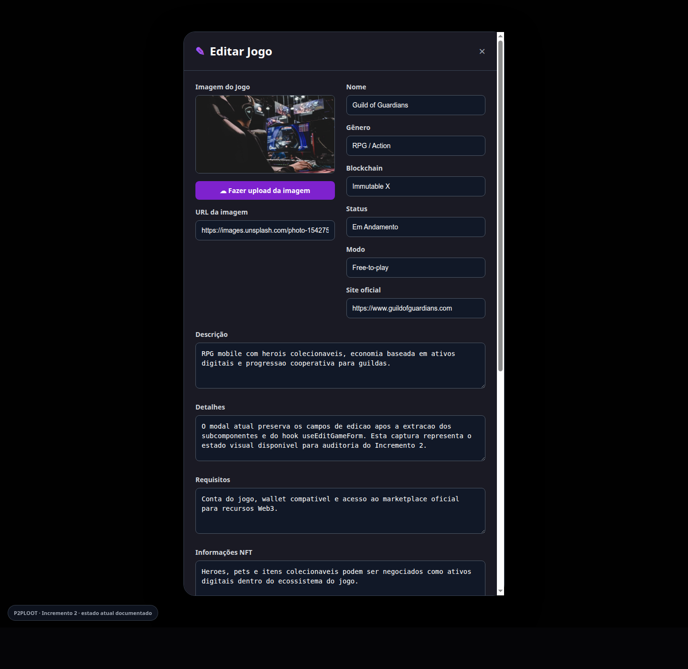

Arquivo: `docs/evidencias/frontend/incremento-2-edit-game-modal/estado-atual-edit-game-modal-desktop-topo.png`

#### Desktop — final do modal

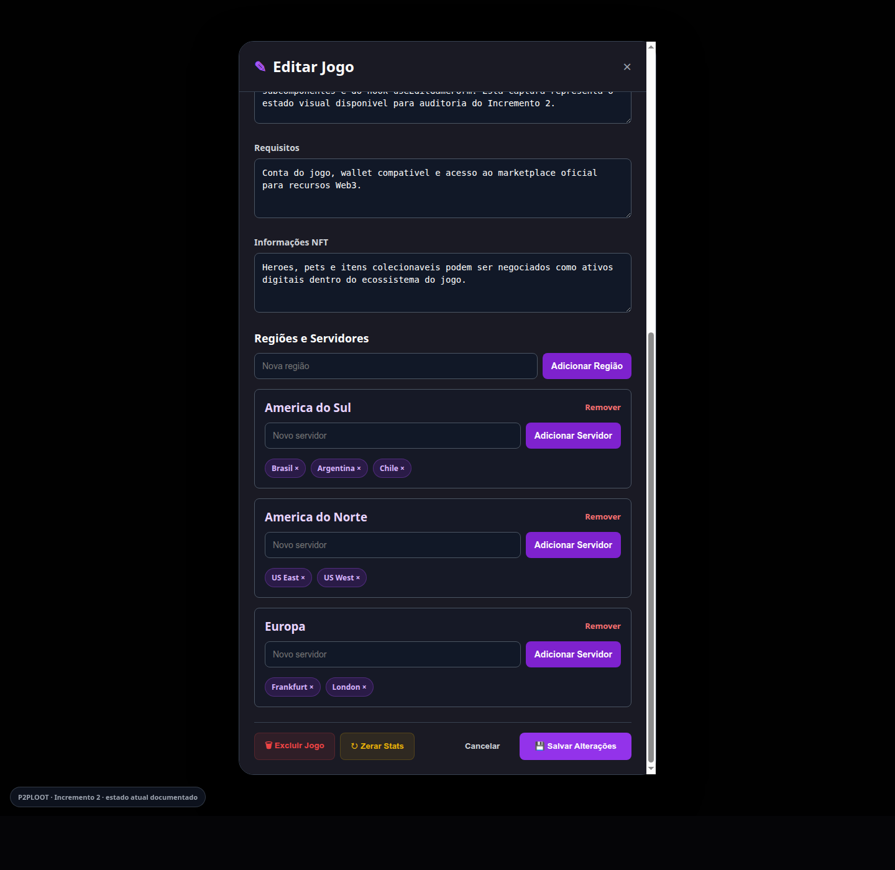

Arquivo: `docs/evidencias/frontend/incremento-2-edit-game-modal/estado-atual-edit-game-modal-desktop-final.png`

#### Mobile — topo do modal

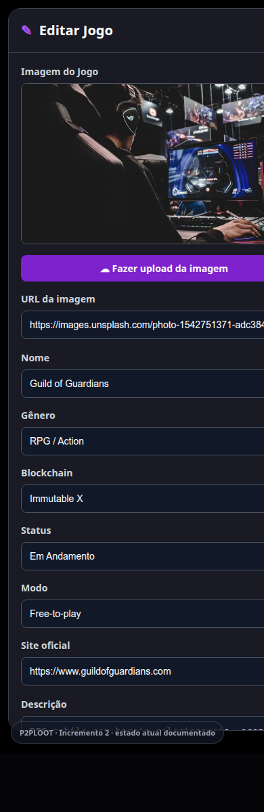

Arquivo: `docs/evidencias/frontend/incremento-2-edit-game-modal/estado-atual-edit-game-modal-mobile-topo.png`

#### Mobile — final do modal

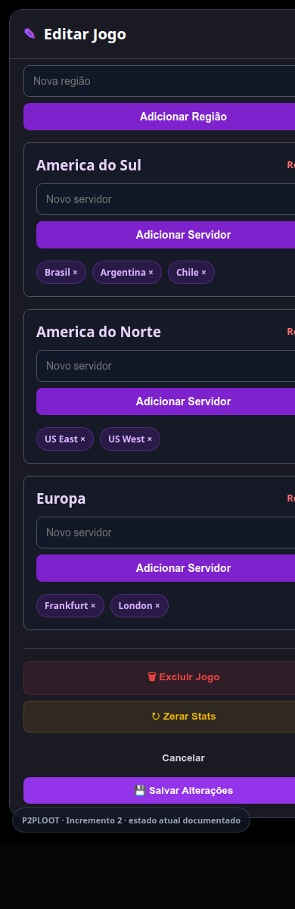

Arquivo: `docs/evidencias/frontend/incremento-2-edit-game-modal/estado-atual-edit-game-modal-mobile-final.png`

Critério visual:

- O modal deve exibir campos de imagem, upload, URL, dados básicos do jogo, descrições, requisitos, informações NFT, regiões/servidores e ações finais.
- Como não há prints anteriores disponíveis, a validação visual retroativa fica limitada à revisão do estado atual documentado.
- Para os próximos incrementos, a documentação deve conter prints comparativos antes/depois capturados durante a iteração.

### Contratos preservados

- Nenhuma mudança no contrato de `api.updateGame`.
- Nenhuma mudança no contrato de `api.deleteGame`.
- Nenhuma mudança no contrato de `api.uploadImage`.
- Nenhuma mudança esperada nas props públicas de `EditGameModal`.

## Incremento 3 concluído: aproximação entre `AddGameModal.jsx` e `EditGameModal.jsx`

### Resumo

O `AddGameModal.jsx` foi reduzido para atuar como shell/orquestrador do fluxo de criação.

A lógica comum de formulário, upload de imagem e regiões/servidores foi aproximada do fluxo de edição, mantendo os contratos públicos dos modais e das chamadas de API.

### Componentes e módulos criados

- `src/components/Web3Games/components/form/AddGameFormFields.jsx`
  - campos principais do cadastro de jogo;
  - nome, gênero, modo, blockchain, token e status.
- `src/components/Web3Games/components/form/AddGameTextDetailsFields.jsx`
  - descrição curta;
  - detalhes completos;
  - requisitos de sistema.
- `src/components/Web3Games/components/form/gameFormOptions.js`
  - opções compartilhadas de gêneros;
  - opções compartilhadas de status.
- `src/components/Web3Games/hooks/useGameForm.js`
  - estado base de formulário;
  - handler de mudança de campos;
  - upload de imagem;
  - manipulação de regiões e servidores.
- `src/components/Web3Games/hooks/useAddGameForm.js`
  - estado de loading de criação;
  - submit via `api.createGame`;
  - reset do formulário após criação bem-sucedida.

### Reutilizações aplicadas

- `AddGameModal.jsx` passou a reutilizar `GameImageUploadField`.
- `AddGameModal.jsx` passou a reutilizar `ServerRegionsEditor`.
- `useEditGameForm.js` passou a reutilizar `useGameForm.js` para lógica comum.
- `EditGameFormFields.jsx` passou a usar `gameFormOptions.js` para evitar listas duplicadas.
- `GameImageUploadField.jsx` ganhou parâmetros de layout com defaults compatíveis com o modal de edição, permitindo preservar o layout vertical usado no modal de criação.

### Commit do incremento

- `refactor(web3games): share add and edit game form logic` (`d0a1fac`)

### Validação

- `git diff --check` executado com sucesso.
- Smoke test da função `filterGamesByStatus` executado com sucesso via `node --input-type=module`.
- `VITE_API_URL=http://localhost:6110 npm run build` executado com sucesso.
- Observação: o build manteve os avisos já conhecidos de Rollup sobre anotações `/*#__PURE__*/` em dependências de terceiros.

### Evidências visuais

Status: documentado com comparação antes/depois em desktop e mobile.

Contexto validado:

- Área: modal de cadastro de jogo (`AddGameModal`).
- Estado: modal aberto em modo de criação, com formulário inicial vazio.
- Fonte do antes: `refs/remotes/origin/teste`, capturado em worktree temporária.
- Fonte do depois: branch do Incremento 3 `feat/web3games-add-edit-form-increment-3`.
- Rota/harness: `__add_game_modal_evidence__.html` servindo o modal isolado via Vite.
- Perfil/usuário: não aplicável; captura isolada do modal sem autenticação.
- Viewports: desktop `1440x1200` e mobile `390x1000`.
- Estados capturados: topo do modal e final do modal após scroll interno.

Prints:

#### Antes — desktop, topo do modal


#### Depois — desktop, topo do modal

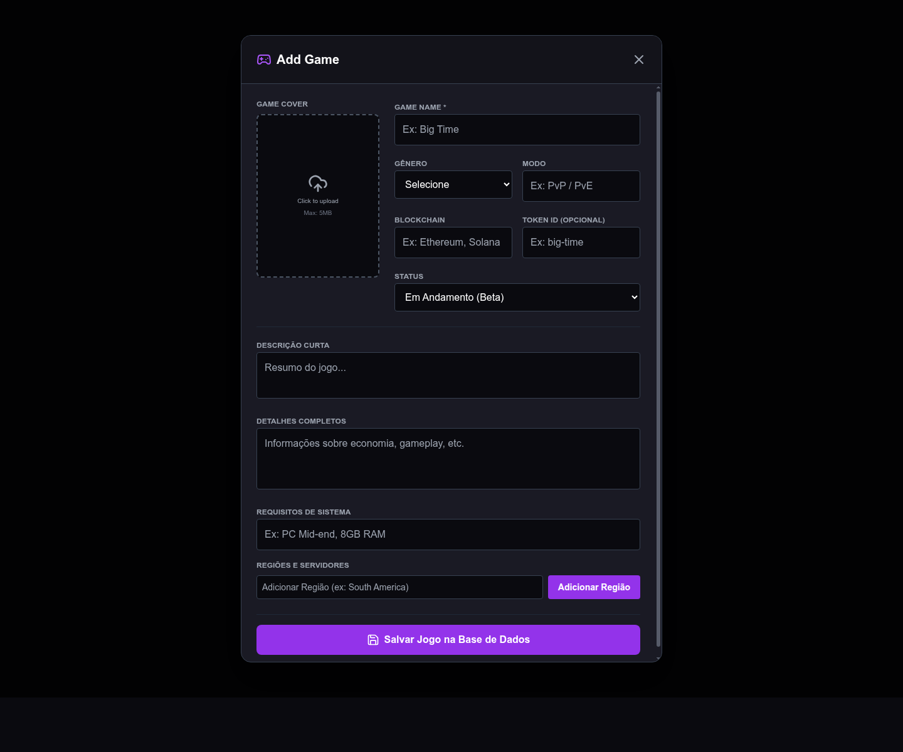

#### Antes — desktop, final do modal

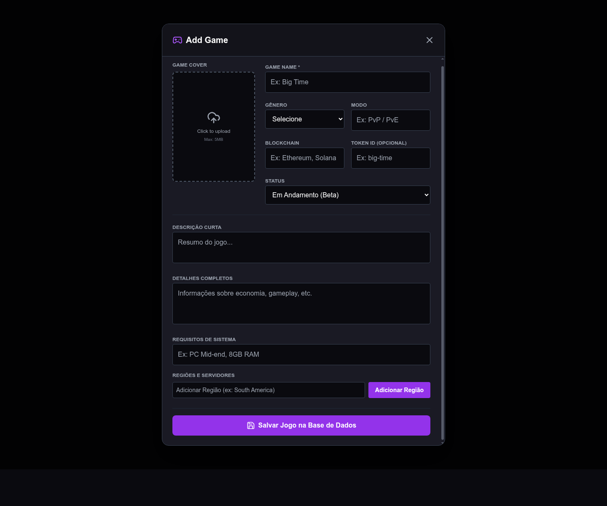

#### Depois — desktop, final do modal


#### Antes — mobile, topo do modal


#### Depois — mobile, topo do modal

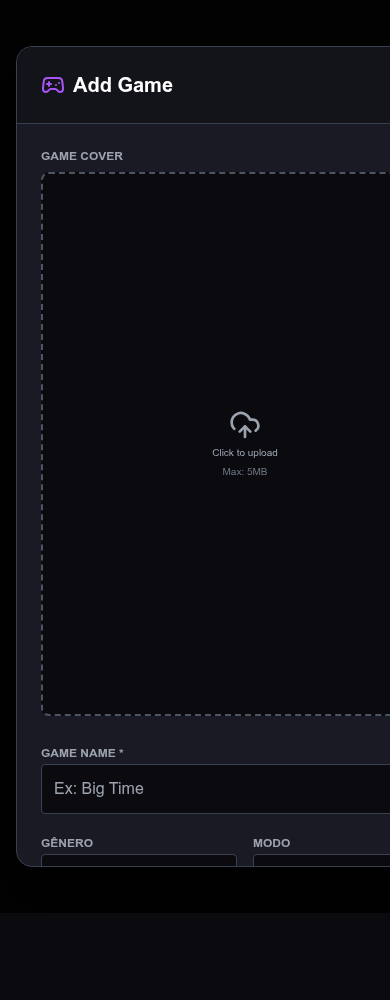

#### Antes — mobile, final do modal


#### Depois — mobile, final do modal

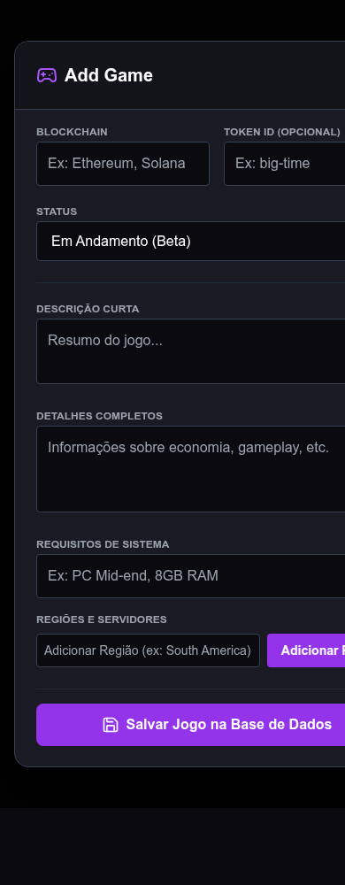

Critério visual:

- A refatoração buscou preservar a experiência visual do modal de criação.
- As capturas antes/depois devem manter layout, campos e ações finais equivalentes em desktop e mobile.
- Qualquer diferença visual esperada deve ser limitada à implementação compartilhada do componente de upload, sem alteração intencional de fluxo.

### Contratos preservados

- Nenhuma mudança no contrato de `api.createGame`.
- Nenhuma mudança no contrato de `api.uploadImage`.
- Nenhuma mudança no contrato de `api.updateGame`.
- Nenhuma mudança esperada nas props públicas de `AddGameModal`.
- Nenhuma mudança esperada nas props públicas de `EditGameModal`.

## Incremento 4 concluído: filtros do catálogo

### Resumo

O cálculo e o estado dos filtros do catálogo foram extraídos de `Web3GamesHome.jsx`, deixando a página mais focada em layout, modais e composição das seções.

A filtragem por status, gênero, blockchain e busca passou a ficar em uma função pura, enquanto o estado de filtros, accordions e listas derivadas passou para um hook dedicado.

### Arquivos criados

- `src/components/Web3Games/hooks/useGameFilters.js`
  - gênero selecionado;
  - blockchain selecionada;
  - busca;
  - abertura dos accordions;
  - listas derivadas de gêneros/blockchains;
  - seções filtradas de jogos em andamento e próximos lançamentos;
  - função `clearFilters`.
- `src/components/Web3Games/utils/gameFilters.js`
  - filtro puro por status, gênero, blockchain e busca;
  - preservação dos aliases existentes `Todos`, `Todas` e `All`.

### Arquivos modificados

- `src/components/Web3Games/Web3GamesHome.jsx`
  - passou a consumir `useGameFilters`;
  - manteve a mesma renderização de sidebar, busca e seções.

### Commits do incremento

- `refactor(web3games): extract catalog filter logic` (`67d41ff`)

### Validação

- `git diff --check` executado com sucesso.
- Smoke test da função `filterGamesByStatus` executado com sucesso via `node --input-type=module`.
- `VITE_API_URL=http://localhost:6110 npm run build` executado com sucesso.

### Evidências visuais

Status: documentado com comparação antes/depois em desktop e mobile.

Contexto validado:

- Área: catálogo de jogos Web3 (`Web3GamesHome`).
- Rota: `/pt/games`.
- Fonte do antes: `HEAD` da branch atual em worktree temporária.
- Fonte do depois: working tree atual após a extração do Incremento 4.
- Perfil/usuário: visitante não autenticado.
- Dados usados: estado vazio do catálogo com API local sem dados disponíveis para a captura.
- Viewports: desktop `1440x1000` e mobile `390x1000`.
- Estados capturados: página do catálogo com filtros abertos, busca vazia e empty states das seções.

Prints:

#### Antes — desktop


#### Depois — desktop


#### Antes — mobile


#### Depois — mobile


Resultado visual:

- Preservado sem mudança visual esperada.
- A comparação cobre a equivalência de sidebar, accordions, busca e empty states em desktop e mobile.

### Contratos preservados

- Nenhuma mudança em contratos `api.*`.
- Nenhuma mudança nas rotas de `Web3Games`.
- Nenhuma mudança esperada nas props públicas de `Web3GamesHome`, `FilterAccordion` ou `GameCard`.

## Incremento 5 concluído: seções visuais do catálogo

### Resumo

`Web3GamesHome.jsx` foi reduzido novamente para atuar como composição de alto nível do catálogo.

A sidebar de filtros, a barra de busca e as seções de listagem foram extraídas para componentes visuais dedicados, preservando o estado e a lógica já centralizados no `useGameFilters`.

### Componentes criados

- `src/components/Web3Games/components/GamesSection.jsx`
  - título;
  - ícone;
  - lista de jogos;
  - empty state;
  - props para voto, favorito e edição.

- `src/components/Web3Games/components/GamesSidebarFilters.jsx`
  - sidebar completa de filtros;
  - ação de limpar filtros;
  - uso de `FilterAccordion`.

- `src/components/Web3Games/components/GamesSearchBar.jsx`
  - input de busca;
  - ícone visual de pesquisa;
  - props controladas para valor e alteração.

### Arquivos modificados

- `src/components/Web3Games/Web3GamesHome.jsx`
  - passou a compor os novos componentes visuais;
  - manteve controle de modais, hooks e handlers principais.

### Commits do incremento

- `refactor(web3games): extract catalog presentation components` (`4987673`)

### Validação

- `git diff --check` executado com sucesso.
- `VITE_API_URL=http://localhost:6110 npm run build` executado com sucesso.
- Lints do IDE sem erros nos arquivos alterados.

### Evidências visuais

Status: documentado com comparação antes/depois em desktop e mobile.

Contexto validado:

- Área: catálogo de jogos Web3 (`Web3GamesHome`).
- Rota: `/pt/games`.
- Fonte do antes: branch `feat/web3games-catalog-sections-increment-5` antes da extração visual.
- Fonte do depois: working tree atual após a extração do Incremento 5.
- Perfil/usuário: visitante não autenticado.
- Dados usados: estado vazio do catálogo com API local sem dados disponíveis para a captura.
- Viewports: desktop `1440x1000` e mobile `390x1000`.
- Estados capturados: página do catálogo com filtros abertos, busca vazia e empty states das seções.

Prints:

#### Antes — desktop


#### Depois — desktop

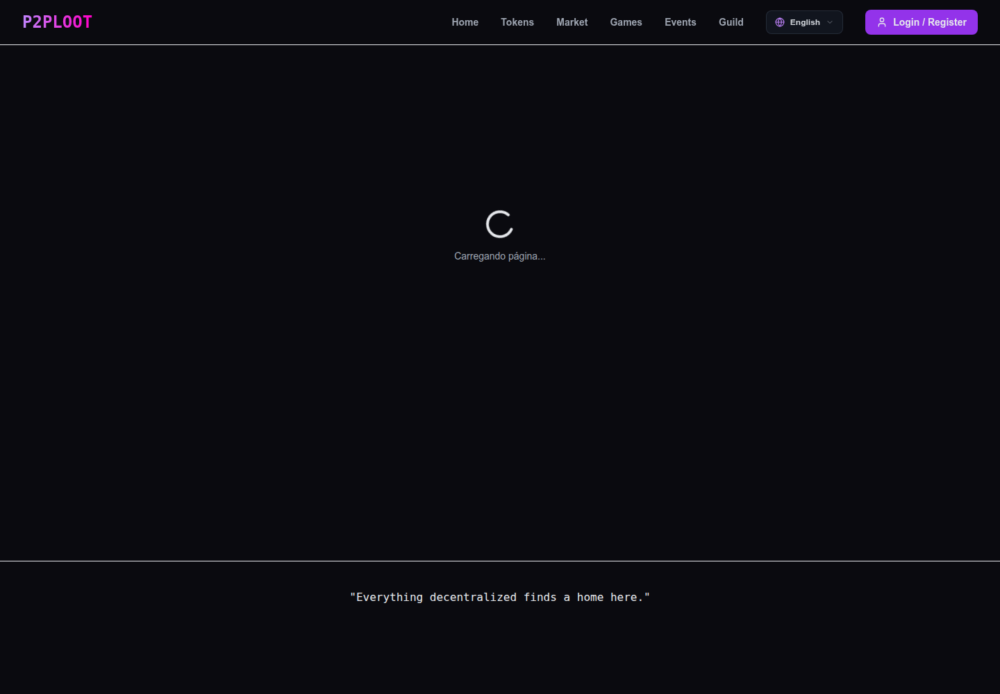

#### Antes — mobile

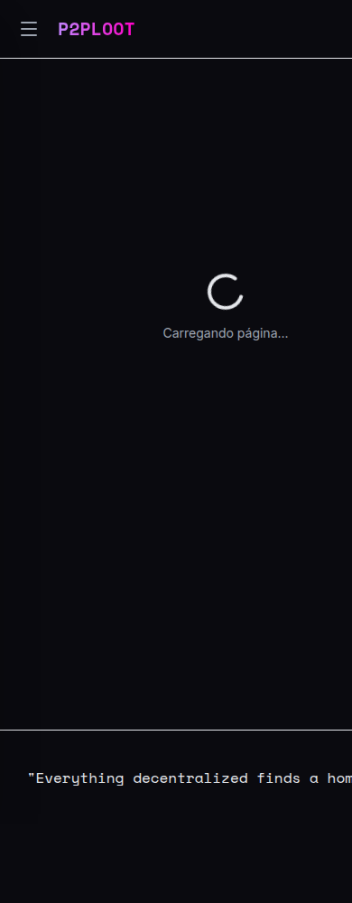

#### Depois — mobile

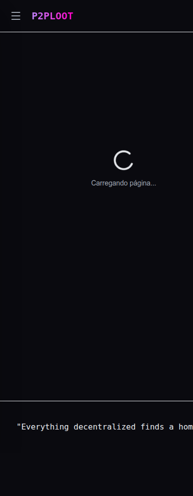

Resultado visual:

- Preservado sem mudança visual esperada.
- A comparação cobre a equivalência de sidebar, busca, títulos de seção e empty states em desktop e mobile.

### Contratos preservados

- Nenhuma mudança em contratos `api.*`.
- Nenhuma mudança nas rotas de `Web3Games`.
- Nenhuma mudança esperada nas props públicas de `Web3GamesHome`, `FilterAccordion` ou `GameCard`.

## Incremento 6 concluído: comentários de jogos

### Resumo

A seção de comentários de `GameDetailsPage.jsx` foi extraída para um componente visual dedicado.

A formatação relativa de datas também foi movida para um utilitário reutilizável, mantendo `GameDetailsPage.jsx` mais focado em hero, conteúdo principal, dados técnicos e composição.

### Arquivos criados

- `src/components/Web3Games/components/GameCommentsSection.jsx`
  - cabeçalho da seção de comentários;
  - formulário de novo comentário;
  - empty/loading states;
  - lista de `CommentItem`;
  - repasse dos handlers de voto, resposta e exclusão.

- `src/components/Web3Games/utils/dateFormatters.js`
  - `formatRelativeDate` com suporte a i18n;
  - preservação das mensagens relativas já usadas pela tela.

### Arquivos modificados

- `src/components/Web3Games/GameDetailsPage.jsx`
  - passou a compor `GameCommentsSection`;
  - removeu layout inline da seção de comentários;
  - manteve carregamento de jogo, hook de comentários, permissões e sidebar técnica.

### Commits do incremento

- `refactor(web3games): extract game comments section` (`49c4d96`)

### Validação

- `git diff --check` executado com sucesso.
- Smoke test da função `formatRelativeDate` executado com sucesso via `node --input-type=module`.
- `VITE_API_URL=http://localhost:6110 npm run build` executado com sucesso.
- Lints do IDE sem erros nos arquivos alterados.

### Evidências visuais

Status: documentado com comparação antes/depois em desktop e mobile.

Contexto validado:

- Área: página de detalhes de jogo (`GameDetailsPage`), seção de comentários.
- Rota: `/pt/games/game/db-4`.
- Fonte do antes: branch `feat/web3games-comments-increment-6` antes da extração da seção.
- Fonte do depois: working tree atual após a extração do Incremento 6.
- Perfil/usuário: visitante não autenticado.
- Dados usados: jogo retornado por `/api/games` com id `4`; comentários em estado vazio/visitante.
- Viewports: desktop `1440x2200` e mobile `390x2200`.
- Estados capturados: página de detalhes incluindo hero, conteúdo, sidebar técnica e seção de comentários.

Prints:

#### Antes — desktop

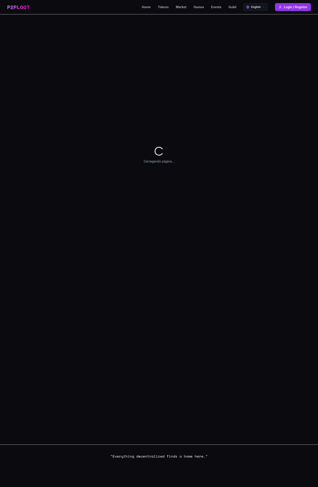

#### Depois — desktop


#### Antes — mobile


#### Depois — mobile

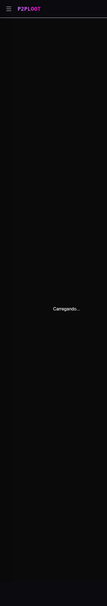

Resultado visual:

- Preservado sem mudança visual esperada.
- A comparação cobre a equivalência da página de detalhes e da seção de comentários em desktop e mobile.

### Contratos preservados

- Nenhuma mudança em contratos `api.*`.
- Nenhuma mudança nas rotas de `Web3Games`.
- Nenhuma mudança esperada nas props públicas de `CommentItem`.

## Incremento 7 concluído: hero e dados técnicos de detalhes

### Resumo

`GameDetailsPage.jsx` foi reduzido novamente para compor regiões de alto nível da página de detalhes.

O hero, a seção "sobre" e o card de dados técnicos foram extraídos para componentes visuais dedicados, mantendo carregamento de dados, comentários, permissões e navegação no container da página.

### Componentes criados

- `src/components/Web3Games/components/GameDetailsHero.jsx`
  - imagem de fundo;
  - botão voltar;
  - badges de status/modo;
  - título, gênero, blockchain e ações principais.

- `src/components/Web3Games/components/GameAboutSection.jsx`
  - descrição curta;
  - bloco `Deep Dive`;
  - título da seção "sobre".

- `src/components/Web3Games/components/GameTechnicalDataCard.jsx`
  - modo, gênero, blockchain, plataforma, status, NFT info e token;
  - regiões e servidores;
  - requisitos do jogo.

### Arquivos modificados

- `src/components/Web3Games/GameDetailsPage.jsx`
  - passou a compor os novos componentes visuais;
  - manteve busca de jogo, hook de comentários, permissões e handlers principais.

### Commits do incremento

- `refactor(web3games): extract game details layout sections` (`85edc31`)

### Validação

- `git diff --check` executado com sucesso.
- `VITE_API_URL=http://localhost:6110 npm run build` executado com sucesso.
- Lints do IDE sem erros nos arquivos alterados.

### Evidências visuais

Status: documentado com comparação antes/depois em desktop e mobile.

Contexto validado:

- Área: página de detalhes de jogo (`GameDetailsPage`), hero, seção sobre e card técnico.
- Rota: `/pt/games/game/db-4`.
- Fonte do antes: branch `feat/web3games-details-layout-increment-7` antes da extração visual.
- Fonte do depois: working tree atual após a extração do Incremento 7.
- Perfil/usuário: visitante não autenticado.
- Dados usados: jogo retornado por `/api/games` com id `4`.
- Viewports: desktop `1440x2200` e mobile `390x2200`.
- Estados capturados: página de detalhes incluindo hero, conteúdo, sidebar técnica e seção de comentários.

Prints:

#### Antes — desktop


#### Depois — desktop


#### Antes — mobile


#### Depois — mobile

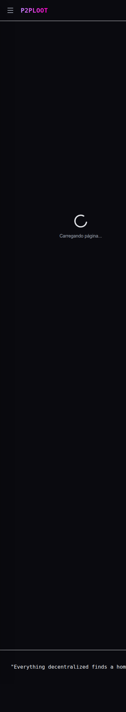

Resultado visual:

- Preservado sem mudança visual esperada.
- A comparação cobre a equivalência do hero, conteúdo principal, dados técnicos e comentários em desktop e mobile.

### Contratos preservados

- Nenhuma mudança em contratos `api.*`.
- Nenhuma mudança nas rotas de `Web3Games`.

## Incremento 8 concluído: página de blockchain

### Resumo

`BlockchainDetailsPage.jsx` foi modularizado em componentes visuais e hook dedicado para jogos relacionados.

A página agora fica focada em localizar a blockchain, compor as regiões da tela e controlar navegação, enquanto busca de jogos relacionados e blocos visuais ficam isolados.

### Componentes e módulos criados

- `src/components/Web3Games/components/BlockchainHero.jsx`
  - imagem de fundo;
  - botão voltar;
  - badges de token/tipo;
  - título e link para site oficial.

- `src/components/Web3Games/components/BlockchainInfoCard.jsx`
  - descrição da rede;
  - consenso;
  - foco principal.

- `src/components/Web3Games/components/RelatedGamesGrid.jsx`
  - título da seção de jogos do ecossistema;
  - grid/lista de jogos relacionados;
  - empty state;
  - ação de edição para perfis com permissão.

- `src/components/Web3Games/hooks/useBlockchainRelatedGames.js`
  - busca jogos via `api.getGames()`;
  - filtra por blockchain;
  - normaliza com `mapApiGameToRelatedGame`.

### Arquivos modificados

- `src/components/Web3Games/BlockchainDetailsPage.jsx`
  - passou a compor os novos componentes;
  - manteve fallback de blockchain não encontrada;
  - preservou navegação para catálogo e detalhes de jogo.

### Commits do incremento

- `refactor(web3games): extract blockchain details sections` (`24bdf92`)

### Validação

- `git diff --check` executado com sucesso.
- `VITE_API_URL=http://localhost:6110 npm run build` executado com sucesso.
- Lints do IDE sem erros nos arquivos alterados.

### Evidências visuais

Status: documentado com comparação antes/depois em desktop e mobile.

Contexto validado:

- Área: página de detalhes de blockchain (`BlockchainDetailsPage`).
- Rota: `/pt/games/blockchain/Open%20Loot`.
- Fonte do antes: branch `feat/web3games-blockchain-page-increment-8` antes da extração.
- Fonte do depois: working tree atual após a extração do Incremento 8.
- Perfil/usuário: visitante não autenticado.
- Dados usados: blockchain local `Open Loot`; jogos relacionados em empty state.
- Viewports: desktop `1440x1400` e mobile `390x1400`.
- Estados capturados: hero da blockchain, info card e seção de jogos relacionados.

Prints:

#### Antes — desktop

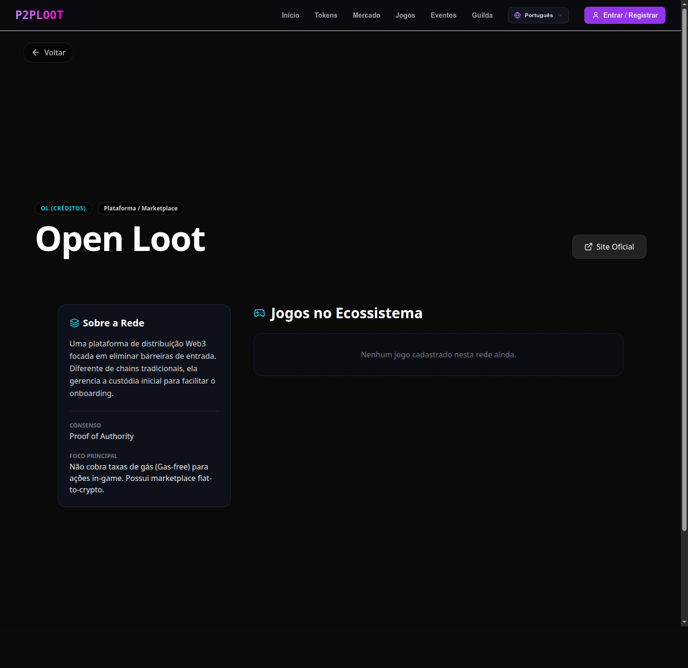

#### Depois — desktop

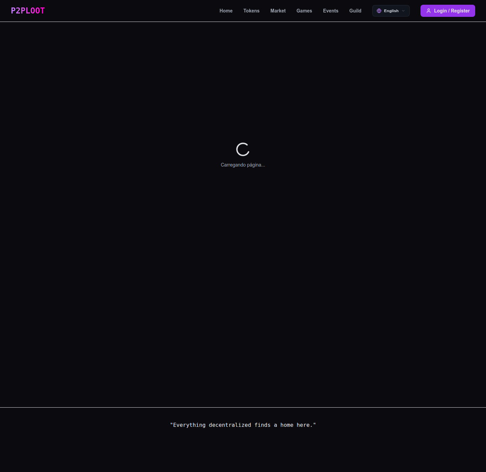

#### Antes — mobile

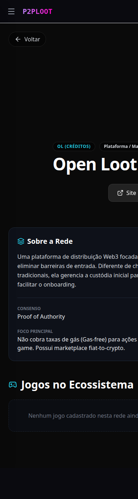

#### Depois — mobile

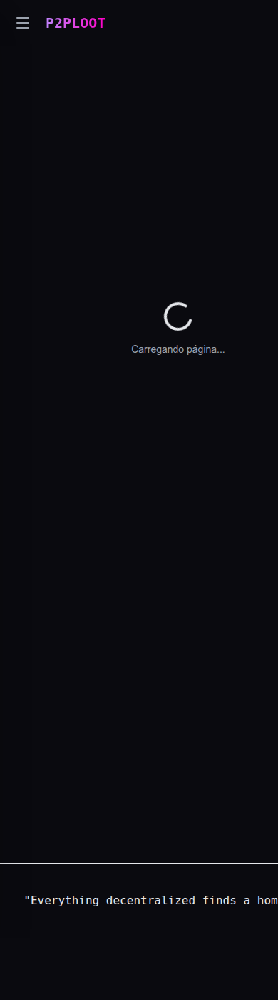

Resultado visual:

- Preservado sem mudança visual esperada.
- A comparação cobre hero, info card e empty state de jogos relacionados em desktop e mobile.

### Contratos preservados

- Nenhuma mudança em contratos `api.*`.
- Nenhuma mudança nas rotas de `Web3Games`.

## Próximos incrementos recomendados

Após estabilizar os incrementos de `Web3Games`, reavaliar outros P0 do relatório original.

## Ordem sugerida de execução

1. Reavaliar outros P0 do relatório original após estabilizar `Web3Games`.

## Checklist por incremento

Antes de iniciar:

- Verificar `git status --short`.
- Confirmar se há arquivos com alterações locais de outro desenvolvedor.
- Escolher um bloco com fronteira clara.
- Capturar prints do estado anterior quando o incremento tocar frontend, visualização ou UX.
- Registrar rota, usuário/perfil, viewport, dados usados e estado da tela nos prints de antes.

Durante a alteração:

- Evitar mudanças de comportamento não solicitadas.
- Não alterar backend.
- Preservar imports e exports usados por rotas.
- Preferir funções puras em `utils` quando possível.
- Preferir hooks para estado e efeitos.
- Capturar prints intermediários se houver mudança de fluxo, modal, loading, erro, sucesso ou estado vazio relevante.

Após a alteração:

- Rodar build com `VITE_API_URL` local.
- Conferir se `dist` não entrou no Git status, caso não seja esperado.
- Capturar prints do estado final usando o mesmo cenário dos prints de antes.
- Comparar visualmente antes/depois e registrar se houve preservação visual ou mudança intencional de UX.
- Registrar arquivos criados/modificados.
- Atualizar este documento com o incremento concluído.
- Anexar ou referenciar os prints em uma seção `Evidências visuais` do incremento.

## Template de evidências visuais

Cada incremento com impacto em frontend, visualização ou UX deve incluir uma seção neste formato:

```md
### Evidências visuais

Contexto validado:

- Rota:
- Perfil/usuário:
- Viewport:
- Dados usados:
- Estado da tela:

Prints:

- Antes: `docs/evidencias/frontend/incremento-N-nome-curto/antes-descricao.png`
- Depois: `docs/evidencias/frontend/incremento-N-nome-curto/depois-descricao.png`
- Estados adicionais:
  - `docs/evidencias/frontend/incremento-N-nome-curto/estado-adicional.png`

Resultado visual:

- Preservado sem mudança visual esperada; ou
- Mudança intencional de UX:
  - o que mudou;
  - por que mudou;
  - impacto esperado para validação/auditoria.
```

## Comando de validação recomendado

```bash
VITE_API_URL=http://localhost:6110 npm run build
```

Caso exista uma URL real de API para ambiente de desenvolvimento, ela pode substituir `http://localhost:6110` apenas para validação do build.